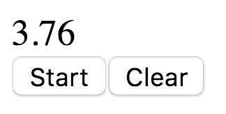
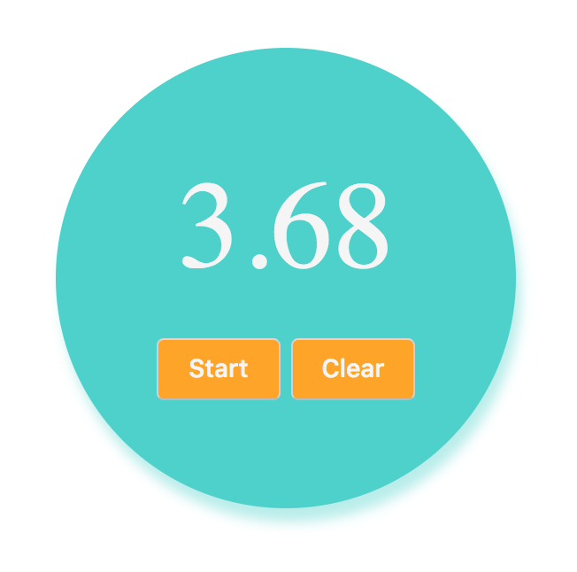

# Workshop: Build a stopwatch

 
The goal is to build a timer that you can start, pause and reset back to 0.

Write your code in `index.html`

 
 

## Optional

- Make your watch display the time like a real stopwatch would:
 

 
- Add some css styling to your stopwatch, something like:
 

 
